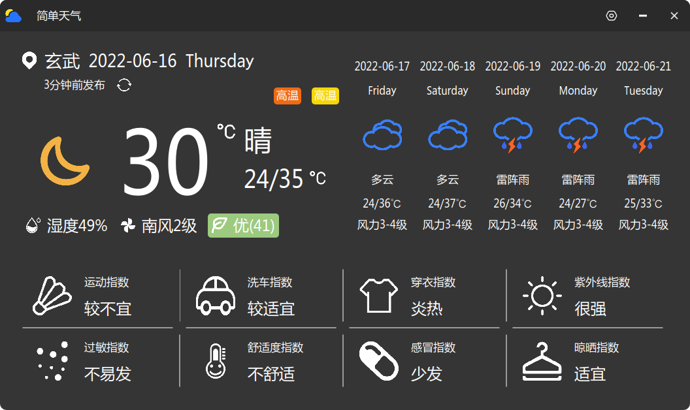

# XWeather
A crossed-platform weather application for desktop, built by Qt5 and Cmake.


#### 1. Build Environment
- Qt5(>5.9)
- CMake(>3.3)

You may install `libqt5x11extras5-dev` to kill the cmake error from `FIND_PACKAGE(Qt5 COMPONENTS X11Extras REQUIRED)`.

```shell
sudo apt install libqt5x11extras5-dev
```

#### 2. Build Step

##### 2.1 Install 
Assume that you are at the dir of project root.
```shell
1. mkdir build && cd build
2. cmake ..
3. make 
4. sudo make install
```

You may modify the macro of ``Qt5_DIR`` on Windows or `CMAKE_PREFIX_PATH` on Linux.
```cmake
IF(CMAKE_SYSTEM_NAME MATCHES "Linux")
    SET(CMAKE_PREFIX_PATH "/usr/lib/x86_64-linux-gnu/cmake")
ELSEIF(CMAKE_SYSTEM_NAME MATCHES "Windows")
    SET(Qt5_DIR "D:/Qt/Qt5.12.11/5.12.11/mingw73_64/lib/cmake/Qt5")
ENDIF()
```

##### 2.2 Uninstall
Assume that you are at the build dir.
```shell
xargs rm < install_manifest.txt
```

#### 3. Build Deb packet
Assume that you are at the build dir.
```
1. cmake ..
2. cpack
```
Then, you will find a deb packet at build dir.

#### 4. Release Deb packet
You can download the .deb packet in release page and install it, if your distribution linux is deepin(v20) or uos(v20).
The .deb packet is built by Qt5.11.3 in release page, so you may not be enable to install the .deb in other distribution linux.
